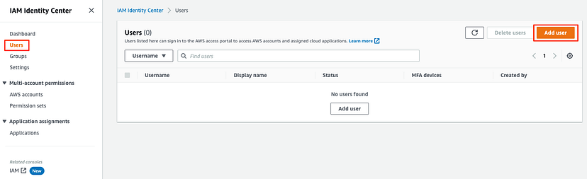
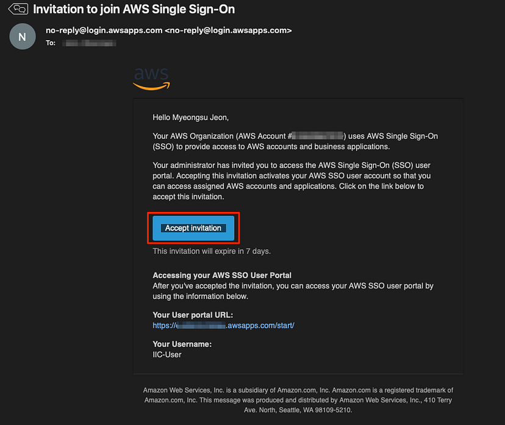
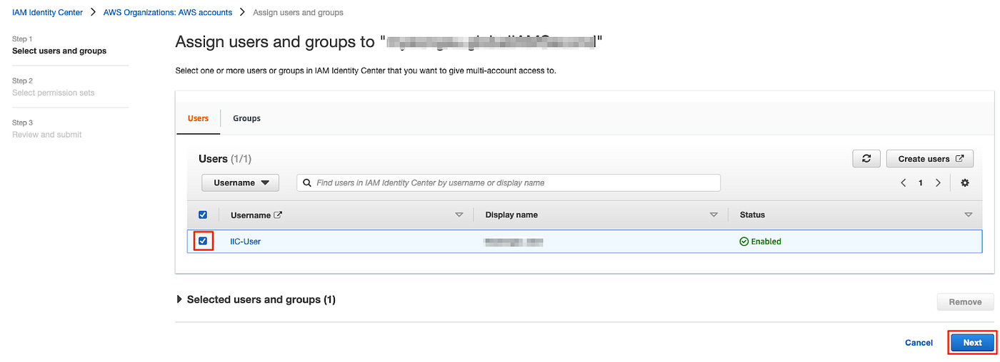

# Using IAM as a strategy to secure Multi-account for small and medium businesses
### Discover AWS IAM for Small and Medium Businesses. Manage IT costs, enhance data security, and grow with the power of cloud computing

## A Centralized Identity Management Service for AWS
AWS IAM Identity Center is a cloud-based identity and access management (IAM) service that helps organizations centrally manage workforce identities and access across all their AWS accounts and applications. IAM Identity Center provides a single place to create, manage, and assign access to workforce users, groups, and applications. It also provides features such as single sign-on (SSO), multi-account permissions, and application assignments, which can help organizations simplify identity management and improve security.

### AM Identity Center supports two types of access
- AWS account access: AWS account access allows workforce users to access AWS resources in a specific AWS account.
-  Application access: Application access allows workforce users to access IAM Identity Center enabled applications, cloud applications, and customer Security Assertion Markup Language (SAML 2.0) applications.

### Key Features
IAM Identity Center offers a number of key features, including:

- Simplified identity management: IAM Identity Center provides a single place to create, manage, and assign access to workforce users, groups, and applications. This can help organizations simplify their identity management processes and reduce overhead or reduce the risk of errors.
- Multi-account access and Centralized control: IAM Identity Center allows you to assign workforce users access to multiple AWS accounts with a single set of permissions. This makes it easier to manage user access across your AWS environment. This can help organizations improve visibility and auditability of their IAM environment by reducing the risk of unauthorized access to AWS resources and applications.

- Workforce identities: IAM Identity Center allows you to create and manage workforce users and groups. You can also connect to an existing identity source, such as Microsoft Active Directory or Okta, and synchronize users and groups to IAM Identity Center.

- Application access: IAM Identity Center also allows you to assign workforce users access to IAM Identity Center enabled applications, cloud applications, and customer Security Assertion Markup Language (SAML 2.0) applications. This provides a single sign-on experience for users to access all of their AWS resources and applications.

- Security and Scalability: IAM Identity Center uses multi-factor authentication (MFA) and other security features to protect your workforce identities. IAM Identity Center is a highly scalable service that can support organizations of all sizes. It can be deployed in minutes and can handle millions of users and applications.

### Benefits
IAM Identity Center offers a number of benefits, including:

- Improved security: IAM Identity Center helps organizations improve the security of their workforce identities by centralizing identity management and using MFA and other security features.
- Reduced complexity: IAM Identity Center simplifies identity management by providing a single place to manage workforce users and groups, as well as multi-account access and application access.

- Increased agility: IAM Identity Center helps organizations increase their agility by making it easier to provision and manage workforce users and access to AWS resources and applications.

- Auditing: IAM Identity Center provides detailed audit logs of all user activity. You can use these logs to track user activity and troubleshoot problems.

- Permissions: IAM Identity Center allows you to create permission sets. Permission sets are collections of permissions that define what a user can do in AWS. You can assign permission sets to users and groups.

- Groups: IAM Identity Center allows you to create groups of workforce users. Groups can be used to simplify permission management by assigning permissions to groups instead of individual users.

- Reduced costs: IAM Identity Center can help organizations reduce their IAM costs by streamlining identity management and eliminating the need to duplicate IAM resources across multiple AWS accounts.

### How it works
IAM Identity Center works by integrating with your existing identity source, such as Microsoft Active Directory, Okta, Ping Identity, JumpCloud, Google Workspace, or Azure Active Directory (Azure AD). This allows you to use your existing identity infrastructure to manage workforce identities in IAM Identity Center.

Once you have integrated IAM Identity Center with your identity source, you can create workforce users and groups in IAM Identity Center, or synchronize your existing users and groups from your identity source. You can then assign workforce users and groups to AWS accounts and applications using multi-account and application assignments.

When a workforce user signs in to the AWS access portal, they will be authenticated by IAM Identity Center. If the user is authorized to access the AWS account or application that they are trying to access, IAM Identity Center will grant them access.

## How to get started with IAM Identity Center

### Create an IAM Identity Center

Navigate to the IAM Identity Center service menu in the AWS Management Console and create an IAM Identity Center. Click the Enable button.

To create IAM Identity Center, the AWS Organizations service must be created in advance. If the AWS Organization service is not created, the following pop-up window will appear. Read the contents of the pop-up window and click the Create AWS organization button.
For a detailed description of the AWS Organization service, please visit https://aws.amazon.com/organizations/

When the creation of IAM Identity Center is completed, the Dashboard appears as shown below. If you want to change your identity source, click Choose your identity source to change it. In this lab, we will use the Identity Center directory, which is the identity source provided by IAM Identity Center by default.

 Add a User to IAM Identity Center
The IAM Identity Center, like IAM, can create Users and manage them as Groups. Note: An IAM Identity Center User is a different entity than an IAM User or AWS Account.

To add a user to the IAM Identity Center, select Users from the left menu and click the Add User button.

Enter IIC-User for the Username, and an email of your choice in the Email address and Confirm email address fields. Write your first and last name in First name and Last name fields, and click the Next button at the bottom of the screen.

IAM Identity Center Users can also be managed as Groups just like IAM Users. However, in this lab, we will not create a group. Click the Next button.

After confirming that all information entered is correct, click the Add user button at the bottom of the screen.

If the IAM Identity Center User is successfully created as shown below, an invitation email is sent to the email address entered in step 2.

If you click Accept invitation in the invitation email, you will be taken to a screen where you can set a password.

 Set a new password and click Set new password.

### Login to the AWS access portal
The IAM Identity Center User created above can login through the AWS access portal. Note: The AWS access portal exists separately from the AWS Managed Console

If you click the AWS access portal URL in the IAM Identity Center Dashboard, .you can go to the AWS access portal screen.

Enter the Username and Password you created before and click the Sign in button.

Since this is a new user, you do not have any applications yet. If you see a page similar to the screen below, you are logged in.

### Creating Permission sets
Permission sets define the level of Access an IAM Identity Center User has to its assigned AWS Accounts. Permission sets appear as available roles in the AWS access portal. If you associate multiple permission sets with one IAM Identity Center User, you can select one of multiple permission sets after logging in.

Select Permission sets from the left menu of IAM Identity Center and click the Create permission set button.

The permission set is divided into the predefined permission set that AWS has defined in advance and the custom permission set in which the user can set the permissions directly. In this lab, we will create a permission that only has full access to Amazon S3. Select Custom permission set and click Next.

A permission set can contain up to 10 AWS managed policies, Customer managed policies, and Inline policies. You can also set Permissions boundaries to control permissions. For this lab, we will only select the AmazonS3FullAccess policy with full access to Amazon S3. After selecting AWS managed policies, search for and select AmazonS3FullAccess and click the Next button.

Enter S3FullAccessPermissionSet in the name of the permission set and click the Next button.

Check that all information is entered correctly, and click the Create button to create a permission set.

### Create AWS accounts
The IAM Identity Center is tightly coupled with the AWS Organizations service. You can add AWS accounts to associate with IAM Identity Center users in the AWS Organizations service.

Go to the AWS Organizations service screen to add a new AWS account. Select AWS accounts from the left menu, select Create an AWS account, enter your desired AWS account name and email address, and click the Create AWS account button.

A verification email will be sent to the email you entered when creating your AWS account. In Email, click Verify your email address to verify.

If the AWS account is successfully created, you can see that a new AWS account has been created in AWS Organizations as shown in the screen below.

### Associating IAM Identity Center Users with AWS accounts
Associate AWS accounts with an IAM Identity Center User.

Select AWS accounts from the menu on the IAM Identity Center service screen, select the newly created account, and click the Assign users or groups button.

Select the IAM Identity Center User to be assigned to the AWS account and click the Next button.

Select the S3 FullAccess Permission Set you made in advance and click the Next button.

Check that everything is correct, and click the Submit button.

### Access the AWS access portal and check whether the permission set is applied
If you connect as an IAM Identity Center User in the AWS access portal, you can access the AWS account to which the permission set you just assigned is applied.

In the AWS access portal, log in as the IAM Identity Center User created above.

Unlike before, you can see that an AWS account is assigned. To check whether only the S3 Full Access permission is given as set in Permission set, click the Management console button.

If you go to the EC2 service to check the permission, you can see that there is no permission. This is expected given our permission set only includes S3.

This time, go to the S3 service and click Create bucket to create an S3 bucket.

Enter a bucket name and click the Create bucket button at the bottom of the screen.

Bucket name must be unique.

You can see that the S3 Bucket has been successfully created.

## Use cases
Startups: IAM Identity Center can help startups simplify their identity management and improve security as they grow.
2. Enterprises: IAM Identity Center can help enterprises centrally manage workforce identities and access across all their AWS accounts and applications.

3. Managed service providers (MSPs): IAM Identity Center can help MSPs manage the identities and access of their customers’ AWS resources.

- Capital One: Capital One uses IAM Identity Center to manage access to AWS for over 100,000 employees. IAM Identity Center has helped Capital One to reduce administrative overhead and improve security.
- GE Healthcare: GE Healthcare uses IAM Identity Center to manage access to AWS for over 50,000 employees. IAM Identity Center has helped GE Healthcare to improve security and reduce the risk of compliance violations.
- NASA: NASA uses IAM Identity Center to manage access to AWS for over 60,000 employees. IAM Identity Center has helped NASA to improve security and reduce the risk of data breaches.
Two-way draft
IAM Identity Center can be used to create a two-way draft between an organization’s workforce and its AWS accounts and applications.

For example, a financial institution uses IAM Identity Center to manage access to its on-premises core banking system ( Active Directory) and its cloud-based customer relationship management (CRM) system(Salesforce and Google Workspace). IAM Identity Center provides a single sign-on (SSO) that allows the financial institution to centrally manage user permissions for both systems, which helps to reduce the risk of unauthorized access.

### This two-way draft can be used to implement a variety of security best practices, such as:

1. Least privilege access: IAM Identity Center can be used to enforce least privilege access by assigning workforce users and AWS accounts and applications the minimum permissions they need to perform their tasks.
2. Zero trust: IAM Identity Center can be used to implement a zero trust security model by verifying the identity of all users and devices before granting access to AWS accounts and applications.

3. Microsegmentation: IAM Identity Center can be used to implement microsegmentation by isolating AWS accounts and applications from each other and from the rest of the organization’s network.

### Best practices for using IAM Identity Center
1. Use multi-account permissions to assign users access to multiple AWS accounts. Multi-account permissions can help you simplify identity management and improve security.
2. Use application assignments to assign users access to IAM Identity Center enabled applications, cloud applications, and customer SAML 2.0 applications. Application assignments can help you simplify identity management and improve security.

3. Use SSO to allow users to sign in to multiple applications using a single set of credentials. SSO can improve the user experience and reduce the risk of password reuse.

4. Use security features such as password strength requirements, MFA, and audit logging to protect your AWS resources and applications from unauthorized access.

## Conclusion
IAM Identity Center is a powerful IAM service that can help organizations of all sizes and types to manage and secure access to AWS accounts and applications. IAM Identity Center provides a centralized place to create and manage workforce identities, assign access to AWS accounts and applications, and enforce security policies.

IAM Identity Center can be used to create a two-way draft between an organization’s workforce and its AWS accounts and applications.

#### Additional official resources
Multi-account strategy for small and medium businesses | Amazon Web Services
Why invest in a multi-account cloud foundation? Small and Medium Businesses (SMB) usually start with a single account…
aws.amazon.com

SMB - Cloud Solutions for Small and Medium Businesses - AWS
Discover how you can better secure your business, reduce IT costs, and more by moving your work to the cloud.
aws.amazon.com

- https://aws.amazon.com/iam/identity-center/

- https://docs.aws.amazon.com/singlesignon/latest/userguide/what-is.html

- Follow me on LinkedIn: linkedin.com/in/danielclement1
