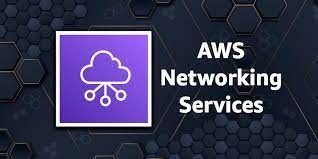
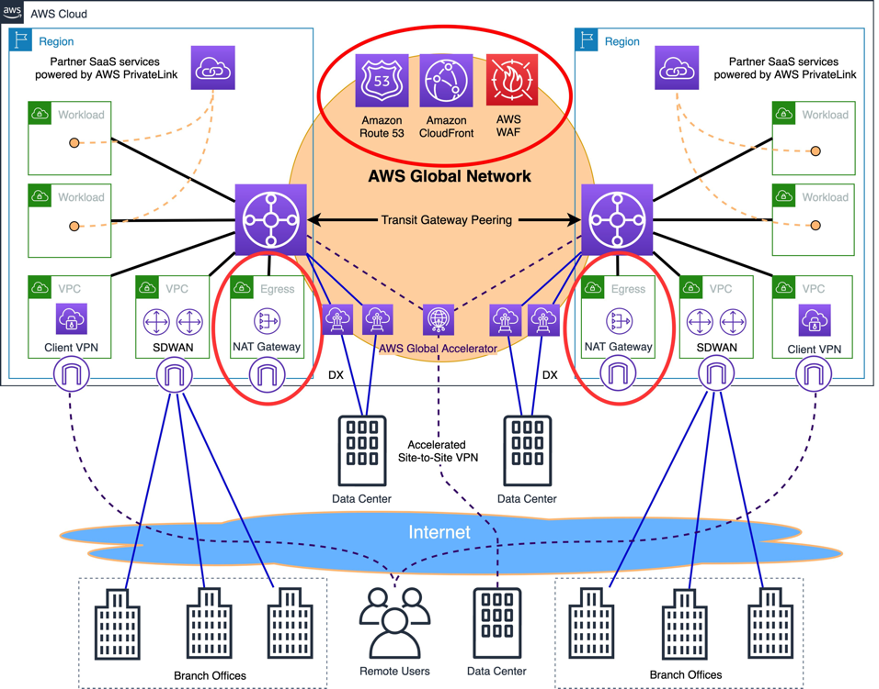

# AWS NETWORKING

AWS Networking is a broad topic that encompasses a wide range of services and features. However, at its core, AWS Networking is all about connecting resources to each other. This can be done in a variety of ways, depending on the specific needs of the application or workload.
One of the most common ways to connect resources in AWS is through the use of Amazon Virtual Private Cloud (VPC). A VPC is a logically isolated section of the AWS Cloud where you can launch your own resources, such as Amazon Elastic Compute Cloud (EC2) instances, Amazon Elastic Kubernetes Service (EKS) clusters, and Amazon Relational Database Service (RDS) databases. Within a VPC, you can create your own subnets, route tables, and security groups to control the flow of traffic between your resources.
Another important AWS Networking service is Amazon Route 53. Route 53 is a highly available and scalable DNS web service that routes traffic to your websites and applications. Route 53 can also be used to create and manage load balancing, which distributes traffic across multiple resources to improve performance and reliability.
### AWS Networking as a Human
To understand AWS Networking better, it is helpful to think of it as a human body. The VPC is the skeleton, and the subnets are the muscles. The route tables are the nerves, and the security groups are the immune system.

**Network Foundations**
- Amazon Virtual Private Cloud (VPC): VPC allows you to create a logically isolated section of the AWS Cloud where you can launch AWS resources in a virtual network that you define.
- AWS Transit Gateway: Transit Gateway is a network transit hub that connects your VPCs, on-premises networks, and other AWS services.
- AWS Direct Connect: Direct Connect allows you to establish a dedicated network connection between your on-premises datacentre and AWS.
- AWS Site-to-Site VPN: Site-to-Site VPN allows you to create a secure encrypted connection between your on-premises network and your VPC.
- AWS Client VPN: Client VPN allows you to securely connect remote users to your VPC.

**Application Networking**
- AWS Elastic Load Balancing (ELB): ELB distribute traffic across multiple instances of your application to improve performance and availability.
- AWS App Mesh: App Mesh is a service mesh that helps you manage communications between microservices.
- AWS Cloud Map: Cloud Map is a service discovery service that helps you manage and discover microservices.
- AWS Gateway Load Balancer: Gateway Load Balancer is a load balancer that helps you distribute traffic across multiple web services.
- AWS API Gateway: API Gateway is a fully managed service that makes it easy to create, publish, maintain, monitor, and secure APIs at any scale.
  
**Edge Networking**
- Amazon CloudFront: CloudFront is a content delivery network (CDN) that delivers your content to users with low latency and high performance.
- AWS Route 53: Route 53 is a domain name system (DNS) web service that routes traffic to your websites and applications.
- AWS Global Accelerator: Global Accelerator is a service that improves the performance and availability of your global applications.

**Network Security**
- AWS WAF: WAF is a web application firewall that helps you protect your web applications from common web attacks.
- AWS Shield: Shield protects your applications from denial-of-service (DoS) and distributed denial-of-service (DDoS) attacks.
- AWS Security Hub: Security Hub provides a comprehensive view of your security state across your AWS accounts.
- AWS Inspector: Inspector analyses your applications for security vulnerabilities.

**Hybrid Connectivity**
- AWS Direct Connect: Direct Connect allows you to establish a dedicated network connection between your on-premises datacenter and AWS.
- AWS Site-to-Site VPN: Site-to-Site VPN allows you to create a secure encrypted connection between your on-premises network and your VPC.
- AWS Client VPN: Client VPN allows you to securely connect remote users to your VPC.
- AWS VPN CloudHub: VPN CloudHub is a service that helps you connect your on-premises network to AWS through a third-party VPN provider.

**Other Networking Services**
- Amazon VPC Peering: VPC Peering allows you to connect two VPCs within the same AWS Region.
- AWS Transit Gateway Connect: Transit Gateway Connect allows you to connect your Transit Gateway to a network outside of AWS.
- AWS Network Firewall: Network Firewall is a managed service that helps you protect your VPC from malicious traffic.
- AWS Network Load Balancer: Network Load Balancer is a load balancer that helps you distribute traffic across multiple instances of your application at the network layer.
- AWS Outposts: Outposts is a service that helps you deploy AWS services on-premises.
## AWS Networking Solutions
*AWS offers a number of networking solutions to help customers solve specific business challenges. These solutions include:*
#### AWS Networking Services: Enabling Secure and Scalable Cloud Infrastructure 
In the era of cloud computing, networking plays a crucial role in connecting applications, services, and data across distributed environments. Amazon Web Services (AWS), the leading cloud provider, offers a comprehensive suite of networking services that enable businesses to build, manage, and secure their cloud infrastructure with unparalleled flexibility and scalability.
#### Connecting to the World with AWS Direct Connect and AWS VPN
To seamlessly integrate your on-premises infrastructure with your AWS cloud environment, AWS Direct Connect provides a dedicated private network connection between your datacenter and AWS. This high-performance connection offers enhanced security, reliability, and reduced latency compared to traditional internet-based connections.
For secure remote access to your AWS resources, AWS Virtual Private Network (AWS VPN) establishes encrypted tunnels between your on-premises networks or devices and your AWS cloud environment. AWS VPN offers two options: AWS Site-to-Site VPN for connecting entire networks and AWS Client VPN for connecting individual users.
#### Managing Traffic Flow with AWS Elastic Load Balancing (ELB)
As your applications and services scale, AWS Elastic Load Balancing (ELB) ensures optimal distribution of traffic across multiple instances, enhancing application performance and availability. ELB offers various load balancers, including Application Load Balancer (ALB) for HTTP and HTTPS traffic, Network Load Balancer (NLB) for TCP and UDP traffic, and Gateway Load Balancer (GWLB) for hybrid cloud workloads.
#### Enhancing Global Connectivity with AWS Global Accelerator
For applications with a global user base, AWS Global Accelerator optimises network traffic routing, ensuring that users connect to the nearest AWS endpoint for the best possible performance. Global Accelerator leverages the AWS global network backbone to provide a reliable and consistent experience for users worldwide.
#### Simplifying Service-to-Service Communication with AWS PrivateLink
AWS PrivateLink enables private connectivity between VPCs and AWS services, as well as third-party services hosted on AWS, without traversing the public internet. This enhances security and simplifies network architecture by keeping traffic within the AWS network.
#### Unifying Network Management with AWS Transit Gateway
For complex network architectures with multiple VPCs and on-premises networks, AWS Transit Gateway acts as a central hub, simplifying network routing and management. Transit Gateway allows you to connect VPCs, on-premises networks, and remote offices, creating a unified network across your entire infrastructure.
#### Securing Network Traffic with AWS Network Firewall
To protect your network from intrusions and malicious traffic, AWS Network Firewall provides a managed firewall service that inspects and filters traffic at the VPC level. Network Firewall offers stateful inspection, intrusion prevention, and content filtering capabilities to safeguard your cloud infrastructure.
#### Optimising Application Performance with Amazon CloudFront
For delivering content with low latency and high transfer speeds, Amazon CloudFront serves as a content delivery network (CDN) that caches content at edge locations around the world. CloudFront accelerates content delivery to users, improving application performance and user experience.
#### Monitoring and Troubleshooting with AWS Networking Tools
AWS provides a suite of tools for monitoring and troubleshooting your network infrastructure. Amazon VPC Flow Logs capture information about network traffic flows, while VPC Traffic Mirroring replicates traffic for analysis and inspection. AWS Network Manager offers a centralised dashboard for managing and monitoring your global network across AWS and on-premises environments.
### AWS Networking Use Cases
*AWS networking services can be used to solve a wide range of business challenges. Here are a few examples:*
- Delivering websites and applications to global users:AWS networking services can be used to build a global network that delivers your websites and applications to users with low latency and high performance.
- Connecting on-premises networks to AWS: AWS networking services can be used to connect your on-premises networks to AWS and build hybrid applications.
- Protecting your networks from security threats: AWS networking services can be used to protect your networks from security threats, such as DoS/DDoS attacks and web application attacks.
- Netflix: Netflix uses AWS Networking to deliver its video streaming service to millions of customers around the world.
- Airbnb: Airbnb uses AWS Networking to power its global marketplace for short-term rentals.
- Spotify: Spotify uses AWS Networking to deliver its music streaming service to over 180 million active users.
- Amazon: Amazon uses AWS Networking to power its e-commerce platform and other businesses
### Conclusion
AWS networking services provide a comprehensive and versatile platform for building, managing, and securing cloud infrastructure. With a wide range of services catering to various networking needs, AWS empowers businesses to achieve scalability, performance, and security in their cloud environments. Whether you're connecting VPCs, managing traffic flow, or securing your network, AWS networking services offer the tools and capabilities to meet the demands of today's dynamic cloud-based applications.
**Additional official information:** 
- AWS Networking documentation: https://docs.aws.amazon.com/vpc
- AWS Networking blog: https://aws.amazon.com/blogs/networking-and-content-delivery/
- AWS Networking whitepapers: https://aws.amazon.com/whitepapers/
- AWS Networking workshops: https://workshops.aws/categories/Networking

