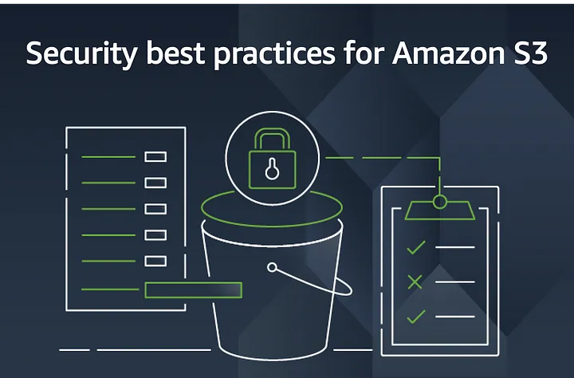

# AWS Storage

Why not invest and transfer your data to the cloud now!

Amazon Web Services (AWS) offers a wide range of storage services to meet the needs of businesses of all sizes. AWS storage services are scalable, secure, and reliable, and they can be used to store any type of data, from website files to enterprise databases. With AWS storage, you can choose the right service for your specific needs, whether you need to store a few gigabytes of data or petabytes of data. AWS storage services are highly scalable, secure, and reliable. They are also backed by Amazon’s global infrastructure, so you can be sure that your data is always accessible and protected.

**In this guide, we will provide a comprehensive overview of AWS storage services. We will discuss the different types of storage available, the features and benefits of each service, and the best use cases for each service.**

### Types of AWS Storage

#### Object Storage
Object storage is a type of cloud storage that stores data as objects. Objects are self-contained units of data that include the data itself, metadata, and access control information. Object storage is highly scalable and cost-effective, making it a good choice for storing large amounts of data, such as images, videos, and log files.

- Amazon Simple Storage Service (S3): S3 is an object storage service that offers industry-leading scalability, data availability, security, and performance. S3 is ideal for storing and managing any amount of data for a range of use cases, such as websites, mobile applications, backup and restore, archive, enterprise applications, IoT devices, and big data analytics.S3 also offers a variety of features for managing and protecting your data, such as access control lists, encryption, and versioning.

#### File Storage
File storage is a type of cloud storage that stores data in files and folders. File storage is a good choice for storing data that needs to be accessed and managed in a traditional file system format.

Amazon Elastic File System (EFS) is a fully managed file storage service for Amazon Elastic Compute Cloud (EC2) instances. EFS provides a scalable, elastic file system that can be used to store and share data between EC2 instances. EFS is also highly available and durable, making it a good choice for storing critical data. EFS is ideal for file sharing applications, such as content management systems, home directories, and collaboration tools.

- Amazon FSx for Windows File Server is a fully managed file storage service that provides a Windows Server file system on AWS. FSx for Windows File Server is a good choice for organizations that need to migrate their on-premises Windows file servers to the cloud.

- Amazon FSx for Lustre is a fully managed file storage service that provides a high-performance Lustre file system on AWS. FSx for Lustre is a good choice for organizations that need a high-performance file system for workloads such as media and entertainment, life sciences, and financial services.

#### Block Storage
Block storage is a type of cloud storage that stores data in blocks. Blocks are fixed-size units of data that are typically used to store data for operating systems, databases, and applications. Block storage is a good choice for storing data that needs to be accessed with high performance and low latency.

- Amazon Elastic Block Store (EBS) is a block storage service for Amazon EC2 instances. EBS provides a variety of volume types to choose from, so you can optimize your performance and costs based on your needs. EBS is also highly available and durable, making it a good choice for storing critical data.

#### Hybrid Storage
Hybrid storage is a combination of on-premises storage and cloud storage. Hybrid storage can be used to improve the performance, scalability, and availability of on-premises storage systems.

- AWS Storage Gateway is a hybrid storage service that connects your on-premises storage to AWS Cloud Storage. Storage Gateway provides a variety of gateway types to choose from, so you can choose the right solution for your needs.

- Amazon Snowball is a data transfer service that allows you to move large amounts of data to and from the AWS cloud. Snowball is ideal for transferring data that is too large to be transferred over the internet, such as video libraries and medical images.

#### Backup and Restore
AWS backup and restore services allow you to back up your data to the cloud and restore it in case of a data loss or disaster.

- AWS Backup is a centralized backup service that allows you to back up data from a variety of AWS services, including EBS, EFS, RDS, and DynamoDB. AWS Backup also provides a variety of features for managing and protecting your backups, such as encryption, versioning, and lifecycle management.

AWS Storage services are priced on a pay-as-you-go basis, meaning that you only pay for the storage that you use. AWS Storage also offers a variety of pricing options to meet the needs of different businesses and use cases.

**Amazon S3 also offers a variety of features to help you manage your data, including:**

- Versioning: Keeps multiple versions of your objects, so you can recover from accidental deletions or modifications.
- Lifecycle management: Automatically transitions objects to different storage classes based on your access patterns.

- Replication: Replicates your objects to multiple regions for disaster recovery.

- General Purpose (gp2): A balanced volume type for a variety of workloads.

- Provisioned IOPS (io1): A volume type for high-performance workloads that require consistent IOPS performance.

- Throughput Optimized HDD (st1): A low-cost volume type for workloads that require high throughput but do not require consistent IOPS performance.

**AWS offers a variety of tools and services to help you manage your storage. These tools and services include:**

- AWS Storage Explorer: A graphical user interface for managing your Amazon S3 buckets and objects.
- AWS Storage Lens: A tool for analyzing your storage usage and costs.

- AWS Resource Groups: A service for tagging and managing your AWS resources, including your storage resources.

- AWS Storage Gateway Management Console: A console for managing your AWS Storage Gateway gateways.

### How to Choose the Right AWS Storage Service
When choosing the right AWS Storage service for your needs, there are a number of factors to consider, including:

- Access patterns: How often will you need to access the data?

- Performance requirements: How important is performance to your application?

- Data durability requirements: How important is it to ensure that your data is not lost or corrupted?

- Cost requirements: How much are you willing to spend on storage?

*If you are unsure which AWS Storage service is right for you, you can use the AWS Storage Selector tool to help you choose.*

**AWS Storage Services**

Amazon Glacier is an archive storage service that provides secure, durable, and low-cost storage for long-term data retention and retrieval needs. Glacier is ideal for storing data that is infrequently accessed, such as backups, medical images and regulatory records.

**AWS storage services offer a variety of features and benefits, including:**

- Scalability: AWS storage services are highly scalable, so you can easily scale your storage up or down as needed.

- Security: AWS storage services are highly secure, with features such as encryption and access control.

- Reliability: AWS storage services are highly reliable, with a 99.999999999% (11 9s) data durability guarantee.

- Cost-effectiveness: AWS storage services are cost-effective, with a variety of pricing options to choose from.

### Best Use Cases for AWS Storage Services

AWS storage services can be used for a variety of purposes, including:

- Website hosting: S3 is ideal for storing and serving website files.

- Data backup and recovery: S3 and Glacier are ideal for backing up and recovering data.

- Application data storage: EFS is ideal for storing application data that needs to be accessed by multiple EC2 instances.

- Database storage: EBS is ideal for storing database files that need to be processed quickly.

- Big data analytics: S3 and Glacier are ideal for storing and analyzing big data datasets.

- Machine learning: S3 is ideal for storing and accessing machine learning data.

### AWS Storage Best Practices

*Here are a few AWS Storage best practices to help you get the most out of your service:*

Use the right storage class for your access patterns: S3 offers a variety of storage classes to optimize costs for different access patterns. Make sure to choose the right storage class for your data to avoid overpaying.

- Use lifecycle policies to automate data management: Lifecycle policies allow you to automate the movement of data between different storage classes based on your access patterns. This can help you to optimize costs and ensure that your data is always stored in the most cost-effective way possible.

- Use encryption to protect your data: AWS Storage services offer a variety of encryption options to protect your data from unauthorized access. Make sure to encrypt your data to ensure that it is always protected.

- Monitor your storage usage: AWS Storage services offer a variety of monitoring tools to help you track your storage usage and costs. Monitor your storage usage regularly to identify any areas where you can optimize costs.

#### Use Cases for AWS Storage Services
Enterprise applications: AWS storage services can be used to store and run enterprise applications, such as CRM and ERP systems.

IoT devices: AWS storage services can be used to store and manage data from IoT devices.

Conclusion
Choose the right storage service for your needs. Consider the type of data you need to store, how frequently you need to access it, and how much you are willing to spend.

Use storage classes to optimize your costs. AWS offers a variety of storage classes, each with its own pricing and performance characteristics. You can use storage classes to tier.

AWS storage services offer a wide range of features and benefits, and they can be used to store any type of data. Whether you need to store website files, database files, or big data datasets, AWS has a storage service that is right for you. AWS storage services are highly scalable, secure, and reliable. They are also backed by Amazon’s global infrastructure, so you can be sure that your data is always accessible and protected.

- https://docs.aws.amazon.com/whitepapers/latest/aws-overview/storage-services.html
- https://aws.amazon.com/products/storage/
- Follow me on linkedin.com/in/danielclement1