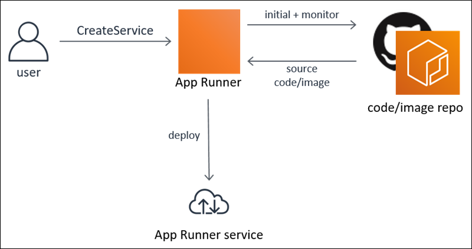

# AWS APP Runner
## What is AWS APP Runner?
*AWS App Runner is an AWS tool that offers a quick, easy, and affordable method of deploying source code or a container image straight to an AWS Cloud web application that is safe and scalable. It is not necessary for you to become proficient in new technologies, choose a compute service, or understand how to deploy and configure AWS resources.
## How it works
* AWS App Runner is a fully managed application service that lets you build, deploy, and run web applications and API services without prior infrastructure or container experience.

* AWS App Runner expands to match your traffic needs, creates and deploys web apps automatically, and lets you configure how services are accessed and communicate with other AWS applications in a private Amazon VPC. It also load balances traffic using encryption. App Runner establishes a direct connection to your image or code source. It offers a completely managed operations pipeline that is automatically integrated and scalable, secure, and performs well.

## Key Features of AWS APP Runner
### Accelerate application development and deployment
### Automatic scaling
### Built-in security and compliance
### Seamless integration with AWS services
### Optimize costs with pay-as-you-go pricing
### Maintain brand consistency with custom domains
### Gain insights with metrics and logs
### Deployment flexibility
* AWS App Runner supports deployment from both source code and container image, allowing you to choose the deployment method that best suits your needs and workflows.
